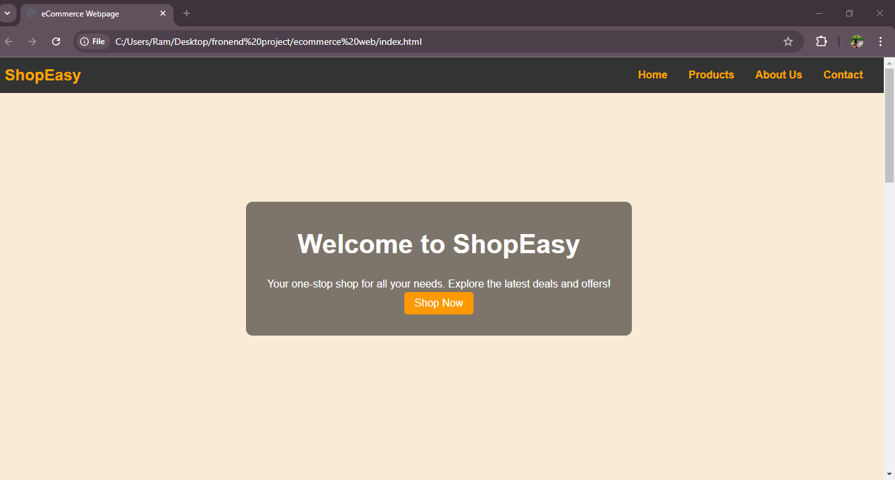

<h1>
  E-Commerce Webpage
</h1>
<h3>
  Summery 
</h3>

  This e-commerce grocery website, crafted with HTML and CSS, offers a user-friendly platform for purchasing daily essentials. The design emphasizes simplicity and accessibility, with a clean layout that ensures smooth navigation. The homepage highlights featured products and categories, while a dedicated grocery page organizes items into clear sections for easy browsing. Each product includes an image, price, and a quick add-to-cart option. Responsive design principles are incorporated, ensuring compatibility across devices, including desktops, tablets, and smartphones. The website includes visually appealing features like hover effects and color schemes to enhance user engagement. Its lightweight coding structure ensures fast loading times, prioritizing user convenience. This project showcases essential front-end development skills, effectively merging aesthetic appeal and functionality to create a seamless grocery shopping experience.

<h4>
  The headder section 
</h4>

